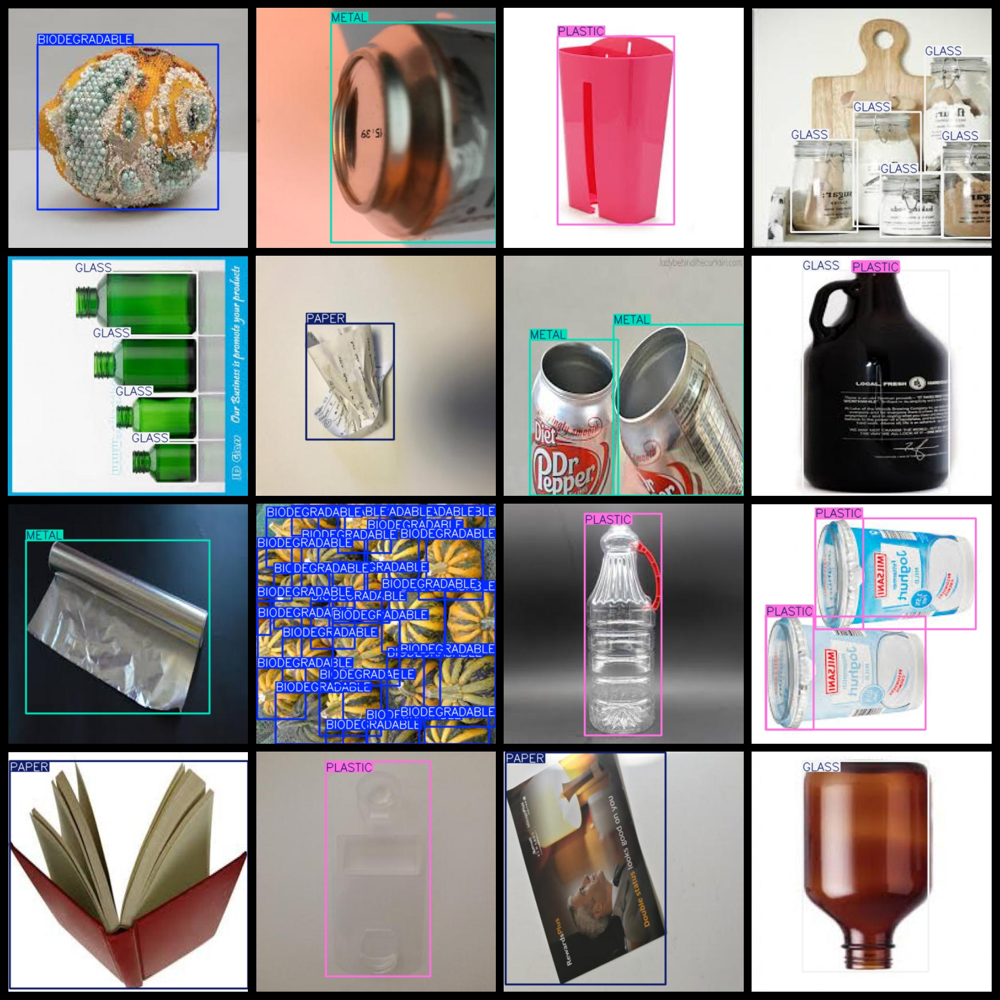
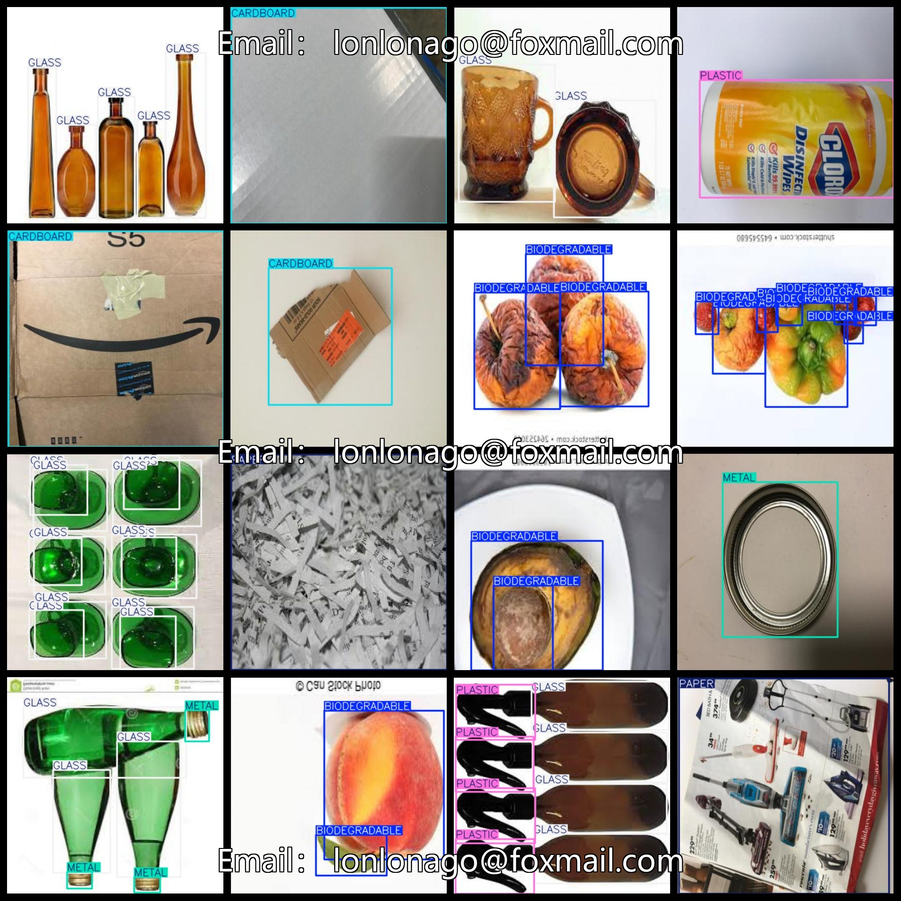
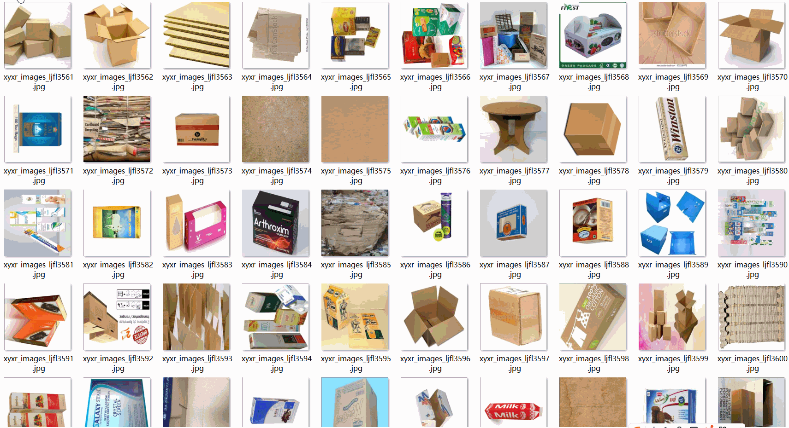
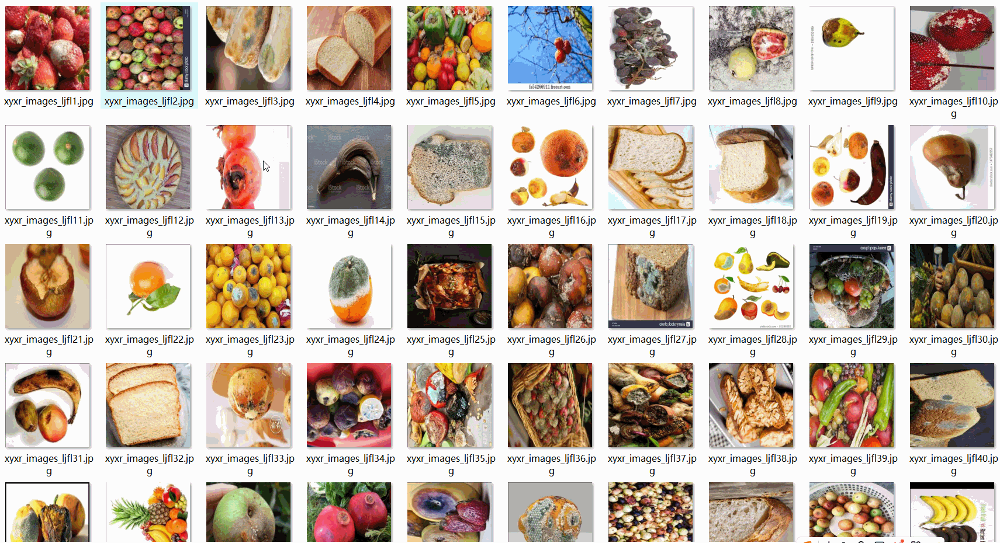

# [Object Detection] Garbage Classification Dataset 10447 images Pcs 6-classYOLO+VOC format

[Object Detection] Garbage Classification Dataset contains 10447 images in both YOLO and VOC formats.

The dataset is organized into three folders: JPEGImages, Annotations, and labels. The JPEGImages folder contains 10447 jpg images, the Annotations folder contains 10447 xml files, and the labels folder contains 10447 txt files.

The number of images in the JPEGImages folder is 10447.

The number of xml files in the Annotations folder is also 10447.

The number of txt files in the labels folder is also 10447.

There are a total of 6 categories in the dataset: ["BIODEGRADABLE", "CARDBOARD", "GLASS", "METAL", "PAPER", "PLASTIC"].

The Chinese translation for each category is as follows:

- "Biodegradable"
- "cardboard" (CARDBOARD)
- "glass" (GLASS)
- "Metal" (METAL)
- "paper" (PAPER)
- "plastics" (plASTIcs)

The number of boxes (yolo format) for each category is as follows:

- BIODEGRADABLE boxes = 43932
- CARDBOARD boxes = 4677
- GLASS boxes = 7809
- METAL boxes = 5841
- PAPER boxes = 4372
- PLASTIC boxes = 5943

Total boxes = 72574

The image resolution (pixels) is clear.

The images have not been enhanced.

The shape of the labels is rectangular boxes, used for target detection recognition.

Important Note: No guarantee is made regarding the accuracy or reasonableness of the labeled data for any trained model or weight files. The dataset is provided for accurate and reasonable annotation only.
## Images

---

Here is a pay link on Stripe (https://buy.stripe.com/3cs8yP7sY87d0vu9AB). Please contact me lonlonago@foxmail.com after funding $89, and I will send you a complete data files, thank you!

